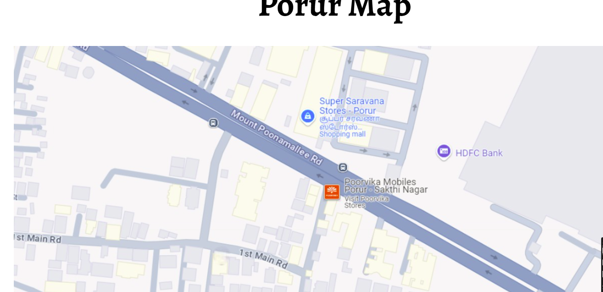

# Ex04 Places Around Me
# Date: 05/10/2024
# AIM
To develop a website to display details about the places around my house.

# DESIGN STEPS
## STEP 1
Create a Django admin interface.

## STEP 2
Download your city map from Google.

## STEP 3
Using <map> tag name the map.

## STEP 4
Create clickable regions in the image using <area> tag.

## STEP 5
Write HTML programs for all the regions identified.

## STEP 6
Execute the programs and publish them.

# CODE:-

# index.html:-

    <html>
        <head>

            <link rel="preconnect" href="https://fonts.googleapis.com">
    <link rel="preconnect" href="https://fonts.gstatic.com" crossorigin>
    <link href="https://fonts.googleapis.com/css2?family=Alegreya:ital,wght@0,400..900;1,400..900&display=swap" rel="stylesheet">
            
            <title>Image map</title>
            
        </head>
        <body>
            

                <h1>Porur Map</h1>
            

            

                
            

            

                            
                

                <map name="image-map">
                    <area target="" alt="AB's Restaurant" title="" href="Saravana stores.html" coords="581,630,553,615,565,576,602,562,647,571,639,622,617,630,606,632" shape="poly">
                    <area target="" alt="Poorvika" title="" href="Poorvika mobiles.html" coords="592,273,632,258,705,262,714,352,602,334,580,312" shape="poly">
                    <area target="" alt="HDFC Bank" title="" href="HDFC Bank.html" coords="816,201,868,184,892,236,857,249,844,233" shape="poly">
                    <area target="" alt="Super Saravana Stores" title="" href="AB's Barbecues Restaurant.html" coords="538,137,590,70,710,93,721,200,587,197" shape="poly">
                </map>

            

            

            

            
        </body>
    </html>
    

# OUTPUT:-

# RESULT
The program for implementing image maps using HTML is executed successfully.
