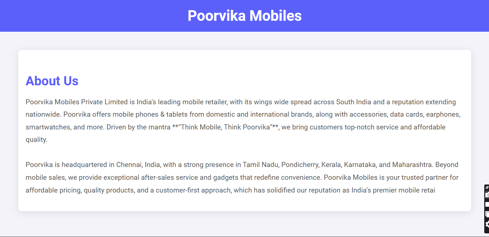
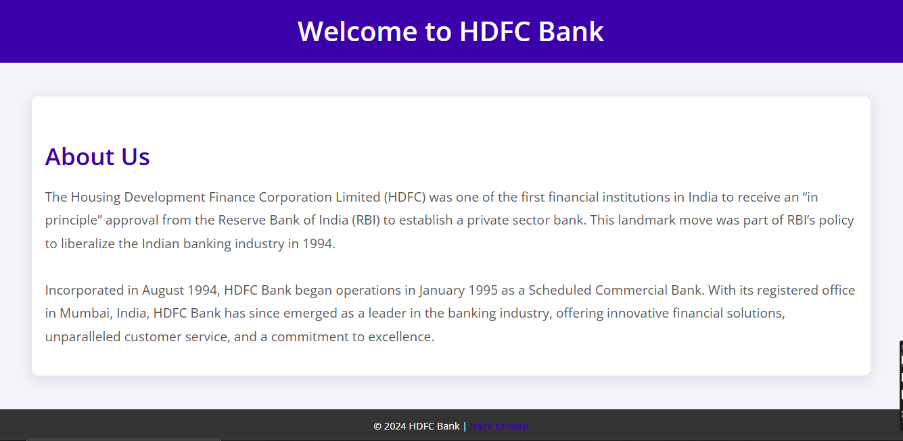
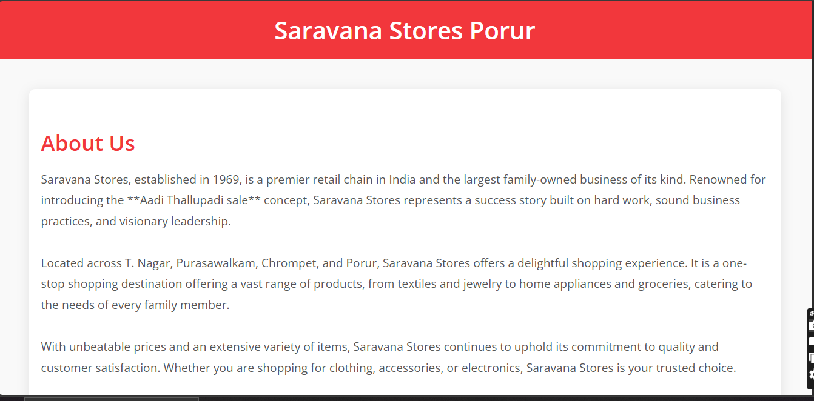
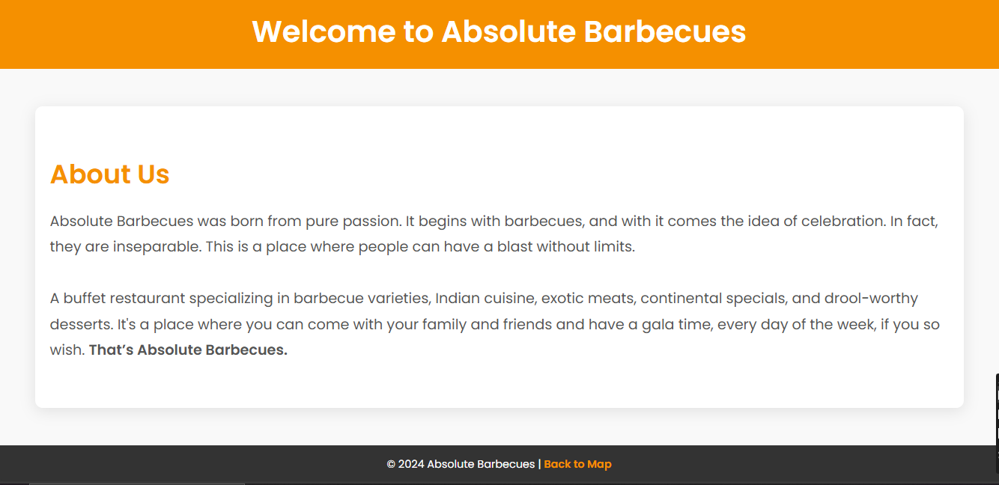

# Ex04 Places Around Me
# Date: 05/10/2024
# AIM
To develop a website to display details about the places around my house.

# DESIGN STEPS
## STEP 1
Create a Django admin interface.

## STEP 2
Download your city map from Google.

## STEP 3
Using <map> tag name the map.

## STEP 4
Create clickable regions in the image using <area> tag.

## STEP 5
Write HTML programs for all the regions identified.

## STEP 6
Execute the programs and publish them.

# CODE:-

# index.html:-

    <html>
        <head>

            <link rel="preconnect" href="https://fonts.googleapis.com">
    <link rel="preconnect" href="https://fonts.gstatic.com" crossorigin>
    <link href="https://fonts.googleapis.com/css2?family=Alegreya:ital,wght@0,400..900;1,400..900&display=swap" rel="stylesheet">
            
            <title>Image map</title>
            
        </head>
        <body>
            

                <h1>Porur Map</h1>
            

            

                
            

            

                            
                

                <map name="image-map">
                    <area target="" alt="AB's Restaurant" title="" href="Saravana stores.html" coords="581,630,553,615,565,576,602,562,647,571,639,622,617,630,606,632" shape="poly">
                    <area target="" alt="Poorvika" title="" href="Poorvika mobiles.html" coords="592,273,632,258,705,262,714,352,602,334,580,312" shape="poly">
                    <area target="" alt="HDFC Bank" title="" href="HDFC Bank.html" coords="816,201,868,184,892,236,857,249,844,233" shape="poly">
                    <area target="" alt="Super Saravana Stores" title="" href="AB's Barbecues Restaurant.html" coords="538,137,590,70,710,93,721,200,587,197" shape="poly">
                </map>

            

            

            

            
        </body>
    </html>
    

# POORVIKA:
    <!DOCTYPE html>
    <html lang="en">
    <head>
        <meta charset="UTF-8">
        <meta name="viewport" content="width=device-width, initial-scale=1.0">
        <title>Poorvika Mobiles</title>
        <link rel="preconnect" href="https://fonts.googleapis.com">
        <link rel="preconnect" href="https://fonts.gstatic.com" crossorigin>
        <link href="https://fonts.googleapis.com/css2?family=Roboto:wght@300;400;700&display=swap" rel="stylesheet">
        
    </head>
    <body>
        <header>
            <h1>Poorvika Mobiles</h1>
        </header>

        

            
        

        

            <h1>About Us</h1>
            

                Poorvika Mobiles Private Limited is India’s leading mobile retailer, with its wings wide spread across South India and a reputation extending nationwide. Poorvika offers mobile phones & tablets from domestic and international brands, along with accessories, data cards, earphones, smartwatches, and more. Driven by the mantra **“Think Mobile, Think Poorvika”**, we bring customers top-notch service and affordable quality.
                  
                Poorvika is headquartered in Chennai, India, with a strong presence in Tamil Nadu, Pondicherry, Kerala, Karnataka, and Maharashtra. Beyond mobile sales, we provide exceptional after-sales service and gadgets that redefine convenience. Poorvika Mobiles is your trusted partner for affordable pricing, quality products, and a customer-first approach, which has solidified our reputation as India’s premier mobile retai
            

        

# SARAVANA:
    <!DOCTYPE html>
    <html lang="en">
    <head>
        <meta charset="UTF-8">
        <meta name="viewport" content="width=device-width, initial-scale=1.0">
        <title>Saravana Stores Porur</title>
        <link rel="preconnect" href="https://fonts.googleapis.com">
        <link rel="preconnect" href="https://fonts.gstatic.com" crossorigin>
        <link href="https://fonts.googleapis.com/css2?family=Open+Sans:wght@300;400;600&display=swap" rel="stylesheet">
        
    </head>
    <body>
        <header>
            <h1>Saravana Stores Porur</h1>
        </header>

        

            
        

        

            <h1>About Us</h1>
            

                Saravana Stores, established in 1969, is a premier retail chain in India and the largest family-owned business of its kind. Renowned for introducing the **Aadi Thallupadi sale** concept, Saravana Stores represents a success story built on hard work, sound business practices, and visionary leadership.
                  
                Located across T. Nagar, Purasawalkam, Chrompet, and Porur, Saravana Stores offers a delightful shopping experience. It is a one-stop shopping destination offering a vast range of products, from textiles and jewelry to home appliances and groceries, catering to the needs of every family member.
                  
                With unbeatable prices and an extensive variety of items, Saravana Stores continues to uphold its commitment to quality and customer satisfaction. Whether you are shopping for clothing, accessories, or electronics, Saravana Stores is your trusted choice.
            

        

        <footer>
            
&copy; 2024 Saravana Stores Porur | <a href="">Back to Map</a>

        </footer>
    </body>
    </html>

# HDFC:
    <!DOCTYPE html>
    <html lang="en">
    <head>
        <meta charset="UTF-8">
        <meta name="viewport" content="width=device-width, initial-scale=1.0">
        <title>HDFC Bank</title>
        <link rel="preconnect" href="https://fonts.googleapis.com">
        <link rel="preconnect" href="https://fonts.gstatic.com" crossorigin>
        <link href="https://fonts.googleapis.com/css2?family=Open+Sans:wght@300;400;600&display=swap" rel="stylesheet">
        
    </head>
    <body>
        <header>
            <h1>Welcome to HDFC Bank</h1>
        </header>

        

            
        

        

            <h1>About Us</h1>
            

                The Housing Development Finance Corporation Limited (HDFC) was one of the first financial institutions in India to receive an “in principle” approval from the Reserve Bank of India (RBI) to establish a private sector bank. This landmark move was part of RBI’s policy to liberalize the Indian banking industry in 1994.
                  
                Incorporated in August 1994, HDFC Bank began operations in January 1995 as a Scheduled Commercial Bank. With its registered office in Mumbai, India, HDFC Bank has since emerged as a leader in the banking industry, offering innovative financial solutions, unparalleled customer service, and a commitment to excellence.
            

        

        <footer>
            
&copy; 2024 HDFC Bank | <a href="">Back to Map</a>

        </footer>
    </body>
    </html>

# RESTAURANT:
    <!DOCTYPE html>
    <html lang="en">
    <head>
        <meta charset="UTF-8">
        <meta name="viewport" content="width=device-width, initial-scale=1.0">
        <title>AB's Absolute Barbecues Restaurant</title>
        <link rel="preconnect" href="https://fonts.googleapis.com">
        <link rel="preconnect" href="https://fonts.gstatic.com" crossorigin>
        <link href="https://fonts.googleapis.com/css2?family=Poppins:wght@300;400;600&display=swap" rel="stylesheet">
        
    </head>
    <body>
        <header>
            <h1>Welcome to Absolute Barbecues</h1>
        </header>

        

            
        

        

            <h1>About Us</h1>
            

                Absolute Barbecues was born from pure passion. It begins with barbecues, and with it comes the idea of celebration. In fact, they are inseparable. 
                This is a place where people can have a blast without limits.   
                A buffet restaurant specializing in barbecue varieties, Indian cuisine, exotic meats, continental specials, and drool-worthy desserts. 
                It's a place where you can come with your family and friends and have a gala time, every day of the week, if you so wish. <strong>That’s Absolute Barbecues.</strong>
            

        

        <footer>
            
&copy; 2024 Absolute Barbecues | <a href="">Back to Map</a>

        </footer>
    </body>
    </html>

# OUTPUT:-

# POORVIKA:

# HDFC:

# SARAVANA:

# RESTAURANT:

# RESULT
The program for implementing image maps using HTML is executed successfully.
